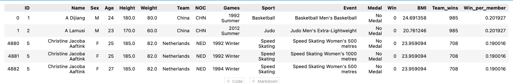
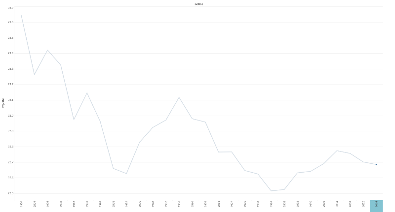
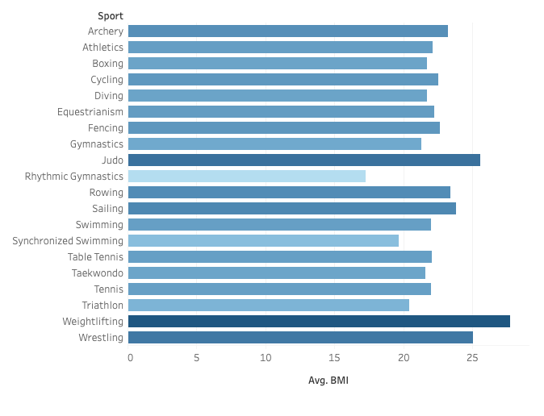
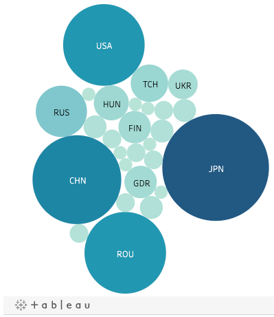
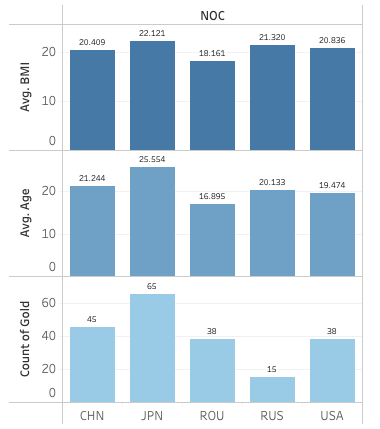

# **Team NaN: Olympic Athletes**

### Index
- [Overview of Analysis](#overview-of-the-analysis)
  - [Presentation](#presentation-slides)
  - [Datasets cleaned](#datasets-cleaned)
- [ETL and Initial Data Exploration](#etl)  
- [Database Outline](#database-outline)
- [Machine Learning Model](#machine-learning-model)
  - [Data Preprocessing](#description-of-data-preprocessing)
  - [Model Choice](#model-choice)
  - [Model Results](#model-results)
- [Dashboard](#dashboard)
  - [Tableau Public](https://public.tableau.com/app/profile/ilias.rafailidis/viz/Olympians_16363169289870/Dashboard1?publish=yes)
  - [Interactive element outline](https://xenia-e.github.io/capstone/)
- [Tools](#tools) 
  
&ensp;

# **Overview of the Analysis**

### [Presentation Slides](https://docs.google.com/presentation/d/1U52iM4x94LprbDG-jespGqqpqwhPP5E583R7NAPjWAU/edit#slide=id.gf795edcdee_0_325)
&ensp;

### **Selected topic**:

Olympic Athletes

## **Questions we hopes to answer with the data**: 

Can we predict whether or not an Olympic athlete will win a medal based on their physical features? We hope to further our analysis and find an interesting correlations between the athlete's physical profile and the country's performance history. 
 
### **Reason we selected the topic**: 

Data is an important part of the sports industry. Not only can data analytics help teams win games, but these statistics can also help improve player performance, prevent injuries and encourage fans to attend games. Through this analysis, our team seeks to determine if it is possible to predict an athlete's performance based on personal features.

### **Description of the source of data**: 

The data was sourced from Kaggle from an article on Olympic Games that delves on data from 120 years of olympic history. The selected tables have data with more than 1,000 data points. The selected two tables were cleaned up using Pandas (Jupyter Notebook) and were explored using PostgreSQL (PgAdmin). 

We used additional data with Olympic countries' Capitals longitude and latitude for creating an interactive map.

Original dataset contains data spanning from Athens 1896 to Rio 2016. Features listed for each athlete are:

- ID (unique identifier for each athlete to account for duplicate names)
- Name
- Sex (F for female, M for male)
- Age
- Height (in cm)
- Weight (in kg)
- Team
- NOC — three-letter code for each country established by the National Olympics Committee (e.g., USA: United States of America)
- Games (e.g., 2008 Summer, 2010 Winter)
- Sport (e.g., Basketball)
- Event (e.g., Basketball Men's Basketball)
- Medal (Gold, Silver, Bronze, NA)

Additional dataset contains listed data for each of the Olympic games:

- Games (e.g., 2008 Summer, 2010 Winter)
- Year
- Season (Summer or Winter)
- City (e.g., Tokyo)

#### Datasets cleaned: 
[Athletes](https://github.com/xenia-e/capstone/blob/main/Resources/Final_athlete_clean_data.csv) and [Games](https://github.com/xenia-e/capstone/blob/main/Resources/olypic_games_clean.csv)

&ensp;

# ETL

### Initial Data Exploration

First we load our dataset using pandas
```
import pandas as pd
          athletes_data = pd.read_csv(f'{file_dir}/Raw_Data/athletes_data.csv', low_memory=False)
          print('Datasset shape:', athletes_data.shape)
          print('Dataset columns:', athletes_data.columns)
```

```

          Datasset shape: (271116, 12)
          Dataset columns: Index(['ID', 'Name', 'Sex', 'Age', 'Height', 'Weight', 'Team', 'NOC', 'Games',
                 'Sport', 'Event', 'Medal'], dtype='object')
```

Using dropna method we clear all rows with no data in features columns for good measure.

```
athletes_data_nona = athletes_data.dropna(subset=['Age', 'Height', 'Weight', 'Sex'])
```
In addition to that we decided to drop more data that did not have a lot of entries to affect dataset using groupby method combined with lambda function. 

```
  athletes_data_nona.groupby('Games').filter(lambda x : len(x)>70)
  athletes_sports.groupby('Sport').filter(lambda x : len(x)>100)
```

Adding new column with corresponding to y values of future machine learning model with 0 for all NA values in and 1 for any other than NA value in 'Medal' column.

```
medals = athletes_data['Medal'].to_list()
        win=[]
          for medal in medals:
            if pd.isna(medal):
              win.append(0)
            else:
              win.append(1)

            athletes_data['Win'] = win
            athletes_data
        
```

Adding body mass index for the Drug Enforcement Administration

```
athletes_data['BMI'] = athletes_data.apply(lambda row: row.Weight/(row.Height*row.Height/10000) , axis=1)

```

Team decided to use team win counts and medals per team athlete as additional data entry:

```
acthletes_medals = athletes_data.groupby("NOC").Win.sum()
        athletes_medals_df = pd.DataFrame(acthletes_medals) #create df
        athletes_medals_df.reset_index(inplace=True) #reset index
        athletes_medals_df.rename(columns = {'Win':'Team_wins'}, inplace = True)
        Team_counts = athletes_data['NOC'].value_counts()
        team_counts_df = pd.DataFrame(Team_counts)
        team_counts_df.reset_index(inplace=True)
        team_counts_df.rename(columns = {'NOC': 'Total_team_members', 'index':'NOC'}, inplace = True)
        medals_merged = pd.merge(team_counts_df, athletes_medals_df, on='NOC', how='inner')
        # calculate wins per team member
        medals_merged['Win_per_member'] = medals_merged.apply(lambda row: row.Team_wins/row.Total_team_members , axis=1)
        # drop total team members
        medals_merged = medals_merged.drop(['Total_team_members'], axis=1)
        athletes_data_merged = pd.merge(athletes_data, medals_merged, on='NOC', how='inner')
        athletes_data_merged['Medal'] = athletes_data_merged['Medal'].fillna('No Medal') # fill NaNs in ' Medal' with ' No Medal
        athletes_data_merged = athletes_data_merged.sort_values('ID')

        athletes_data_merged.head()
```
The final athletes data table:



# Database outline 


&ensp;

# Data Exploration

We sorted all athletes who ever won an Olympic medal, calculated average weight and height of these athletes and put it on the map. The additional layer shows us basic information about each country's performance in the Olympic Games.

### Average Olympic Athlete BMI over the years

An Olympian’s body shape and size directly relate to the sport in which he or she participates, and certain events demand extreme proportions to compete at the highest level. We aim to evaluate the significance of a specific selection of physical attributes: height and weight. For this reason we decided to look into quotient of weight divided by height in meters squared also known as Body Mass Index (BMI)

The BMI line over the years in its beginning probably reflects what the perception of the athletic body, and the human body in general, was at the time. After the 1960’s when technology slowly starts impacting the sciences around sports we notice a slow but steady drop of the BMI. Athletes are now better equipped to efficiently train their bodies. Average BMI has remained in the same levels for the past 20 years.



>Figure 1 - Average Olympic Athlete BMI over the years

## Average BMI in Top Olympic Sports

As expected, BMI varies depending on the sport. On one end, one of the strength sports, we see Judo, Rowing, and Sailing with BMI over 23.0. On the other end, we find sports that require refined movement, flexibility, and stealth-like rhythmic such as gymnastics and synchronized swimming. Endurance sports tend to stand in the middle as some of them depend on strength and others on stamina.

Those athletes with extreme body size and shape are those whose heights and weights directly affect their performance. For instance, gymnastics require a very high strength-to-weight ratio, which is why they tend to be short and muscular, with no superfluous fat.



>Figure 2 - Average BMI (Body Mass Index) in Top Olympic Sports

## Gold Winners in Gymnastics

Countries with decades of tradition in Gymnastics like Japan, China, and Romania demonstrate how in this case the team and its culture have a greater impact on the result than physical attributes do. In the following graph, we will better understand the minute differences between these big teams, by looking at age and BMI average as well as Count of Wins for each country.



>Figure 3 - Gold Winners in Gymnastics

## Gymnastics Top 5 Gold Winners BMI

What an extraordinary case! Japan leads Gold Medals and also has the highest age average as well as the highest BMI average. Romania who sports by far the lowest average BMI and age (18.0 and 17 years old) tie in the third place of all time gold winners with the US that has age and BMI averages closer to the mean. Romania well below all averages has won an amazing 38 gold medals and clearly shows that sometimes tradition is a catalyst.



>Figure 4 - Gymnastics Top 5 Gold Winners BMI

# Machine Learning Model:
Physical attributes are a primary factor for why an athlete will choose to participate in a specific sport. Based on the minute differences between Olympic athlete physical features, can we determine whether or not an athlete will receive an Olympic Medal?

Using data from the Olympic games from 1900 to 2016, we are using a Random Forest Classifier to predict if Olympic athletes will earn a medal based on their physical attributes. Please find the code [here](https://github.com/xenia-e/capstone/blob/main/MachineLearning/Olympics_Machine_Learning_Model.ipynb).

We have connected our code to the AWS database. AWS is connected to a local Postgres server.

#### Description of data preprocessing  
* Body types vary based on sport, so to improve our model's accuracy, we filtered our data to only look at gymnastics. 
* Binned countries with less than 100 entries to "Other" category
* Dropped Name, Team, Sport, Event, Games and Medal columns as these are not needed for our model 
* Converted height and weight from object data to numeric data
* Encoded Sex and NOC as these are object data 

#### Description of feature engineering and the feature selection, including their decision making process  
* X: Sex, Age, Height, Weight, NOC, Year, BMI, Team Wins, Wins Per Member
* y: Win (yes or no) 
* We chose these features because we are looking at the physical attributes of the athletes. We kept NOC (team) and year because these also determine physical attributes. We kept Team Wins and Wins Per Member as these assist with our machine learning model accuracy. 
* We removed Height and Weight data as it is used as a calculation for BMI, but found that our model reduced -1% accuracy score, so we decided to leave the additional Height and Weight data as support for our machine learning model.

#### Data was split into training and testing sets  
* We used the following code to split into training and testing sets:
* X_train, X_test, y_train, y_test = train_test_split(X, y, random_state=42, stratify=y)

#### Model Choice: 
* Balanced Random Forest Classifier: We are using this model to classify whether or not an olympic athlete will earn a medal based on their physical attributes. Due to our data's linear relationship, this model is useful for regression analysis and classification. We can also easily view the relative importance of our input features. This will help to determine the most important features in the training of our model. Lastly, the small trees prevent us from overfitting our model.  
* Limitations: If there are too many trees, it can slow the algorithm. We must check our features to ensure they are important to our model and the model runs effectively. 

#### Description of how the model has been trained so far 
The model was trained to take in athlete physical attribute data and identify whether or not an athlete will receive a medal based on their physical attributes. To train the model, we took the following steps:
1. Split the preprocessed data into a training and testing dataset
2. Create a StandardScaler instances
3. Fit the StandardScaler
4. Scale the data
5. Resample the training data with the BalancedRandomForestClassifier
6. Calculate the balanced accuracy score

We took additional steps to review how well the model performed:
1. Display the confusion matrix
2. Display the imbalanced classification report
3. List the features sorted in descending order by feature importance

#### Additional training that has taken place:
* We hope to further our analysis and find interesting correlations between the athlete's physical profile and the country's performance history.
* Attempted to add 'Year', 'City', and 'Season' from games table, but the added data reduced the accuracy score from 85% to 76%. ML
* Attempted to add 'Year' and bin to reduce number of unique values, but struggled with data type changes in the model. 
* Attempted to filter on Gender, but the added filtering reduced the accuracy score from 85% to 70%. 
* Filtered by sport to view machine model learning accuracy for different sports. See results below.

#### Results from Training Dataset. We took the top 3 sports with greatest participation records:
1. Gymnastics Athletes Balanced Accuracy Score: 91% 
2. Swimming Balanced Accuracy Score: 92%
3. Athletics Balanced Accuracy Score: 87%  - Note ML accuracy drops because there is greater variance in height and weight due to the variety of events in athletics compared to gymnastics and swimmings

#### Results from Testing Dataset. We took the top 3 sports with greatest participation records:
1. Gymnastics Athletes Balanced Accuracy Score: 85% 
2. Swimming Balanced Accuracy Score: 85%
3. Athletics Balanced Accuracy Score: 71%  - Note ML accuracy drops because there is greater variance in height and weight due to the variety of events in athletics compared to gymnastics and swimmings

#### Model Results: 
* The recall on our training dataset indicates that our model can correctly determine if a gymnast has received a medal 91% of the time.
* The recall on our testing dataset indicates that our model can correctly predict if a gymnast will receive a medal 84% of the time.
* With an 85% balanced accuracy score on our testing dataset, we can conclude that on Olympic gymnast's physical features are correlated with whether or not they will receive a medal.

&ensp;

# Dashboard

[Link to Dashboard](https://xenia-e.github.io/capstone/)

In our dashboard we feature a detailed analysis of gold medal winning teams and the association to the team’s average BMI. 

From the pool of all Olympic Sports we follow twenty of the oldest and most popular olympic sports. From these sports we pick Gymnastics, Athletics and Swimming to compare (only Gymnastics included to Dashboard. Follow [Tableau Public](https://public.tableau.com/views/Olympians_16363169289870/TheOlympicGoldStandard) link to see other graphs). 

- Interactive graphs and dashboard were created in [Tableau Public](https://public.tableau.com/views/Olympians_16363169289870/TheOlympicGoldStandard)  

- Interactive map with three additional layers was created using **javascript** and **Leaflet** library. The original dataset was preprocessed and converted into GeoJSON files. 
A map presenting visualizations of countries Olympic achievements and outline of typical Olympic Medal Winner in certain country.  
&ensp;  

- The dashboard also includes information on Machine Learning training and testing models used in our project including accuracy scores, f1 score and feature importance. 

## Tools
To create the final dashboard we will work with JavaScript, Leaflet, CSS and Bootstrap.  
&ensp;


[Back to Index](#index)

